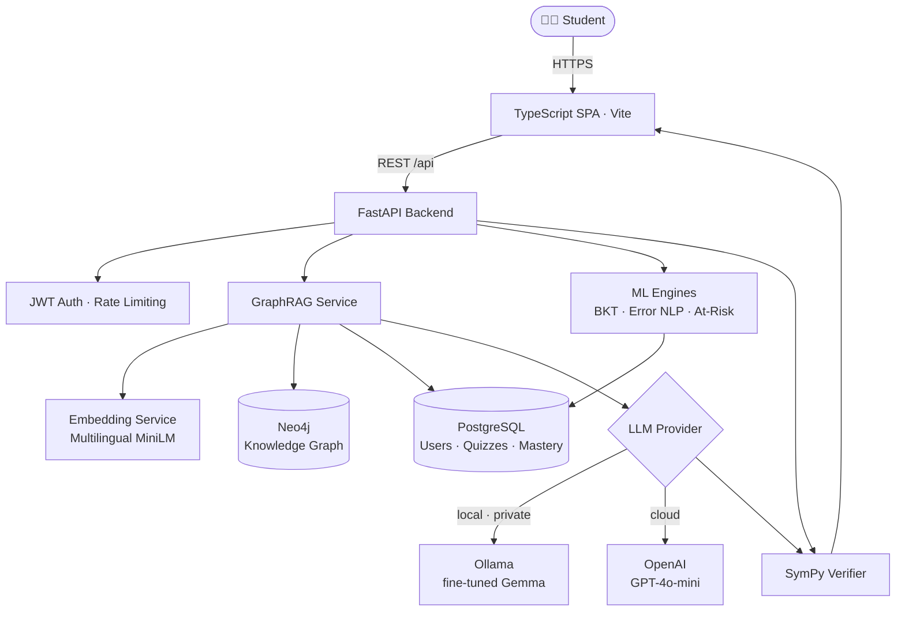
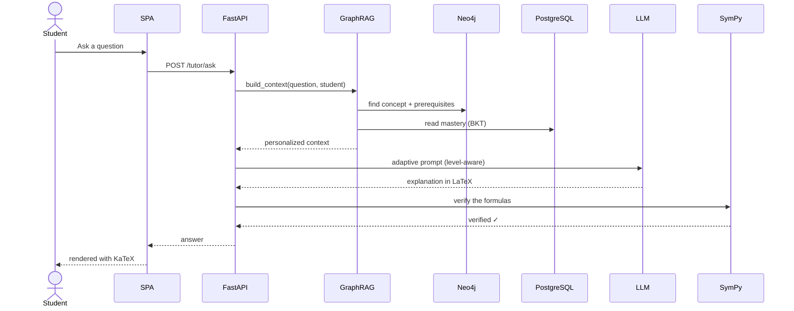

<div align="center">

# 🧠 Intelligent Adaptive Learning Platform
### for Numerical Analysis & Scientific Computing

**An AI-powered tutor that adapts to every student — understanding not just *whether* they are wrong, but *why*.**

[](https://www.python.org/)
[](https://fastapi.tiangolo.com/)
[](https://www.typescriptlang.org/)
[](https://neo4j.com/)
[](https://www.postgresql.org/)
[](https://www.langchain.com/)
[](https://scikit-learn.org/)
[](https://www.docker.com/)
[](LICENSE)

*Final-Year Engineering Project (PFE) · ESPRIT School of Engineering, Tunisia · in partnership with EspritTech*

</div>

---

## 📋 Table of Contents

- [Why this project exists](#-why-this-project-exists)
- [What it does](#-what-it-does)
- [The four AI engines](#-the-four-ai-engines-the-heart-of-the-platform)
- [How students benefit](#-how-students-benefit)
- [Architecture](#️-architecture)
- [How a tutor answer is built](#-how-a-tutor-answer-is-built)
- [Tech stack](#️-tech-stack)
- [Course content](#-course-content)
- [Getting started](#-getting-started)
- [Configuration](#️-configuration)
- [Project structure](#️-project-structure)
- [Quality & testing](#-quality--testing)
- [Screenshots](#️-screenshots)
- [Roadmap](#️-roadmap)
- [Author, supervision & context](#-author-supervision--context)
- [Citation](#-citation)
- [License](#-license)
- [Acknowledgements](#-acknowledgements)

---

## 🎯 Why this project exists

For many students, Numerical Analysis is one of the most challenging courses in an engineering program. It mixes abstract theory, heavy computation, and methods that all look alike (Newton-Raphson vs. Newton interpolation, Trapezoidal vs. Simpson...). In a classroom of dozens of students, a single teacher cannot diagnose *each* student's specific gap in real time.

The result is a familiar one: a student gets an exercise wrong, sees only a red **"incorrect"**, and never learns **why**. Two students can fail the same question for completely different reasons — one misread the problem, the other never mastered a prerequisite — yet both receive the same generic feedback.

> **This platform was built to fix exactly that.** It gives every learner a personal AI tutor that diagnoses the *type* of mistake, adapts the explanation to their real level, and guides them through the prerequisites they actually need.

---

## ✨ What it does

- **🤖 Adaptive AI tutor** — answers questions in numerical analysis, automatically adjusting depth (simplified → standard → rigorous) to the student's measured level.
- **📊 Mastery tracking** — estimates how well each student knows each concept using **Bayesian Knowledge Tracing**, and uses it to personalize everything.
- **🧩 Knowledge graph** — concepts, prerequisites and remediation resources are modeled as a graph in **Neo4j**, so the tutor knows *what you must learn first*.
- **🔎 Semantic retrieval (GraphRAG)** — understands the *meaning* of a question, not just keywords, and enriches the AI's answer with the right concept and the student's profile.
- **🩺 Error diagnosis** — an NLP classifier identifies the **type** of misconception (conceptual, computational, method, perception) to trigger *targeted* remediation.
- **🚨 At-risk detection** — a machine-learning model flags students likely to fall behind, with the top contributing factors.
- **✅ Math verification** — every formula produced by the AI is checked with **SymPy**, so the tutor doesn't hallucinate wrong mathematics.
- **🎬 Visual learning** — concept animations rendered with **Manim**, plus an in-house **interactive SVG engine** where students manipulate methods and see the graph update live.
- **🌍 Bilingual (FR / EN)** — content, tutoring and feedback in both languages.
- **🔐 Production-minded** — JWT authentication, password hashing (bcrypt), and per-route rate limiting.

---

## 🧠 The four AI engines (the heart of the platform)

What makes this more than a quiz app is a stack of four cooperating AI/ML components — internally called **the four bricks**.

### 1. Bayesian Knowledge Tracing (BKT) — *"How well does this student know X?"*
A probabilistic model that updates, after every answer, the probability that a student has truly **mastered** a concept. It separates a lucky guess from real understanding and a careless slip from a genuine gap. This mastery score drives the difficulty of quizzes and the depth of tutor explanations.

### 2. Semantic GraphRAG — *"Which concept is the student really asking about?"*
The student's question is turned into a **vector of meaning** with a multilingual sentence-transformer (`paraphrase-multilingual-MiniLM-L12-v2`) and matched to the closest concept by **cosine similarity** — so *"where does the curve cross zero?"* correctly maps to **Bisection / Newton-Raphson**, even with zero shared keywords. The retrieved concept is then enriched with its **graph neighborhood** (prerequisites, resources from Neo4j) and the **student's mastery** (PostgreSQL) to build a personalized prompt. If embeddings are unavailable, it degrades gracefully to keyword scoring.

### 3. Error Classification (NLP) — *"Why is this answer wrong?"*
Instead of a binary right/wrong, a **scikit-learn** classifier predicts the **type** of error from a taxonomy of 11 misconception types across four families — *conceptual, computational, method,* and *perception*. This turns a red cross into an actionable diagnosis ("you confused two related methods") and a targeted remediation hint.

### 4. At-Risk Detection (ML) — *"Who needs help before it's too late?"*
A logistic-regression model reads behavioral signals (activity, success rate, mastery trends...) and estimates the probability that a student is **at risk** of falling behind — surfacing the **top factors** so intervention can be specific, not generic.

> **Honesty note for evaluators:** retrieval today vectorizes concept **names + descriptions** in memory (with caching), not full lesson bodies; lesson content is stored for future vector indexing. Optional ML bricks fail safe — if a dependency is missing, the platform keeps running with its rule-based behavior.

---

## 🎓 How students benefit

| Before | With this platform |
| --- | --- |
| "Incorrect." — no reason given | "You confused Newton-Raphson with Newton interpolation — here's the difference." |
| Same explanation for everyone | Depth adapts to *your* measured mastery |
| You don't know what to study next | The graph shows the exact prerequisite you're missing |
| Help arrives after you fail | At-risk detection flags struggling learners early |
| Static formulas in a PDF | Interactive graphs + animations you can play with |

---

## 🏗️ Architecture



Four services are orchestrated with Docker Compose: **PostgreSQL** (application data), **Neo4j** (knowledge graph), the **FastAPI** backend, and the **nginx**-served frontend. The LLM runs either **locally** via Ollama (a fine-tuned Gemma model — private, no quota) or in the **cloud** via OpenAI, switchable at runtime.

---

## 🔄 How a tutor answer is built



---

## 🛠️ Tech stack

| Layer | Technologies |
| --- | --- |
| **Frontend** | TypeScript, Vite, custom SPA router, KaTeX (math rendering), in-house interactive **SVG** engine |
| **Backend** | FastAPI, Uvicorn, SQLAlchemy, Pydantic, SlowAPI (rate limiting), python-jose (JWT), passlib + bcrypt |
| **Databases** | PostgreSQL 15 (application data), Neo4j 5 (knowledge graph) |
| **AI / LLM** | LangChain, Ollama (fine-tuned **Gemma** `gemma-numerical-e2b`), OpenAI GPT-4o-mini |
| **ML / NLP** | sentence-transformers (multilingual MiniLM), scikit-learn, joblib |
| **Scientific** | NumPy, SciPy, **SymPy** (answer verification), **Manim** (animations) |
| **DevOps** | Docker Compose, Ruff, Pytest, Playwright (E2E) |

---

## 📚 Course content

The curriculum is modeled as a **prerequisite graph** in Neo4j — **4 modules, 19 concepts**, linked by `COVERS`, `REQUIRES` and `REMEDIATES_TO` relationships.

| Module | Focus | Sample concepts |
| --- | --- | --- |
| **1 · Interpolation** | Reconstructing functions from points | Polynomial basics, Lagrange, Newton, Splines |
| **2 · Numerical Integration** | Computing areas / integrals | Trapezoidal, Simpson, Gaussian quadrature |
| **3 · Approximation & Optimization** | Best fits and minima | Least squares, Orthogonal polynomials, Minimax, Gradient descent, Newton's method |
| **4 · Root-Finding** `f(x)=0` | Solving nonlinear equations | Bisection, Fixed-point, Newton-Raphson, Secant |

---

## 🚀 Getting started

### Prerequisites
- **Docker** & Docker Compose (recommended path)
- *(optional)* **Ollama** on the host, if you want the local fine-tuned LLM instead of OpenAI
- For manual dev: **Python 3.11**, **Node.js 18+**

### Option A — Run everything with Docker (recommended)

```bash
# 1. Configure your environment (never commit the real .env)
cp .env.example .env          # then edit .env with your own values

# 2. Launch the full stack (Postgres + Neo4j + backend + frontend)
docker compose -f docker/docker-compose.yml up --build
```

Once the containers are healthy:

| Service | URL |
| --- | --- |
| 🖥️ Frontend | http://localhost:8090 |
| 📘 API docs (Swagger) | http://localhost:8000/docs |
| 🕸️ Neo4j Browser | http://localhost:7475 |
| 🗄️ PostgreSQL | localhost:5433 |

### Seed the data

```bash
cd backend
python scripts/seed_neo4j.py     # knowledge graph (modules, concepts, prerequisites)
python scripts/seed_content.py   # multi-level lesson content
python scripts/seed_quizzes.py   # quiz banks
```

### Option B — Manual development

```bash
# Backend
cd backend
python -m venv venv && source venv/bin/activate   # Windows: venv\Scripts\activate
pip install -r requirements.txt
uvicorn app.main:app --reload                      # http://localhost:8000

# Frontend (in a second terminal)
cd frontend
npm install
npm run dev                                         # http://localhost:5173
```

---

## ⚙️ Configuration

All configuration is read from a `.env` file (use `.env.example` as a template). **Secrets are never committed** — `.env` is gitignored.

| Variable | Purpose |
| --- | --- |
| `DATABASE_URL` | PostgreSQL connection string |
| `NEO4J_URI` / `NEO4J_USER` / `NEO4J_PASSWORD` | Neo4j connection |
| `SECRET_KEY` / `ALGORITHM` / `ACCESS_TOKEN_EXPIRE_MINUTES` | JWT signing & expiry |
| `LLM_PROVIDER` | `ollama` (local) or `openai` (cloud) |
| `LLM_MODEL_NAME` / `LLM_TEMPERATURE` / `LLM_MAX_TOKENS` | LLM generation settings |
| `OLLAMA_MODEL` / `OLLAMA_BASE_URL` | Local fine-tuned Gemma model |
| `OPENAI_API_KEY` | Required only when `LLM_PROVIDER=openai` |

> ⚠️ **Security:** if a secret was ever exposed, rotate it immediately. Keep real keys only in your local `.env`.

---

## 🗂️ Project structure

```text
.
├── backend/
│   ├── app/
│   │   ├── core/         # config, database, security, lightweight migrations
│   │   ├── data/         # question banks & static taxonomy (11 error types)
│   │   ├── graph/        # Neo4j connection
│   │   ├── models/       # SQLAlchemy models
│   │   ├── routers/      # FastAPI routes (auth, tutor, quiz, study, graph...)
│   │   ├── schemas/      # Pydantic schemas
│   │   └── services/     # business logic: RAG, embeddings, BKT, error NLP, risk, SymPy
│   ├── scripts/          # seeding, model training, Manim rendering
│   └── tests/            # backend tests
├── frontend/
│   └── src/
│       ├── pages/        # SPA pages (dashboard, tutor, quiz, content...)
│       ├── widgets/      # interactive SVG "guided example" engine
│       ├── components/   # reusable UI
│       ├── api.ts        # typed API client
│       └── router.ts     # custom SPA router
├── docker/               # docker-compose.yml (4-service stack)
└── README.md
```

---

## 🧪 Quality & testing

- **Backend tests** — `pytest` in `backend/tests/`
- **End-to-end** — `npm run test:e2e` (Playwright)
- **Linting** — `ruff` for Python
- **Mathematical correctness** — a SymPy verification layer parses and checks every LaTeX formula the AI emits, so explanations are not just fluent but *correct*.

---

## 🖼️ Screenshots

> _Add your own captures here for the defense / portfolio._

| Adaptive Tutor | Dynamic Quiz & Error Analysis |
| --- | --- |
| _`docs/screenshots/tutor.png`_ | _`docs/screenshots/quiz.png`_ |

| Knowledge Graph (Neo4j) | Interactive SVG Example |
| --- | --- |
| _`docs/screenshots/graph.png`_ | _`docs/screenshots/guided.png`_ |

---

## 🗺️ Roadmap

- [ ] Index full lesson bodies for document-level RAG (vector index in Neo4j / pgvector)
- [ ] Teacher & administrator dashboards (cohort analytics, at-risk lists)
- [ ] Replace placeholder remediation links with real curated resources (incl. the platform's own Manim videos)
- [ ] Additional modules (ODEs, linear systems, PDEs)
- [ ] Spaced-repetition scheduling on top of BKT
- [ ] Mobile-friendly experience

---

## 👤 Author, supervision & context

**Yassine Ben Nessib** — Final-Year Engineering Student (Business Intelligence)
🎓 **ESPRIT** — École Supérieure Privée d'Ingénierie et de Technologies, Tunisia

Originally **proposed by Mr. Afif Beji**, this became my **Final-Year Engineering Project (Projet de Fin d'Études — PFE)** — an effort to turn an academic project into something with real, international value: a genuinely adaptive learning platform that helps engineering students master one of their most demanding subjects.

- 💡 **Original idea & academic supervision:** **Mr. Afif Beji** — Civil Engineer & Lecturer at ESPRIT, who proposed the concept and guided the project.
- 🏢 **Host company:** **EspritTech** — for hosting the internship and giving me the freedom to build this project.
- 👨‍💻 **Development:** **Yassine Ben Nessib** — design and implementation of the platform.

---

## 📖 Citation

If you reference this work, please cite it as:

```bibtex
@misc{bennessib2026adaptive,
  author       = {Ben Nessib, Yassine},
  title        = {Intelligent Adaptive Learning Platform for Numerical
                  Analysis and Scientific Computing},
  year         = {2026},
  howpublished = {Final-Year Engineering Project (PFE), ESPRIT School of
                  Engineering, in partnership with EspritTech},
  note         = {Original concept and supervision by Mr. Afif Beji}
}
```

---

## 📜 License

Released under the **MIT License** — see [`LICENSE`](LICENSE). © 2026 Afif Beji.

---

## 🙏 Acknowledgements

Built with gratitude to **EspritTech** for the opportunity, to my supervisor **Mr. Afif Beji** for his guidance, and to the open-source community behind FastAPI, Neo4j, LangChain, scikit-learn, SymPy and Manim — the foundations this platform stands on.

<div align="center">

**⭐ If this project inspires you, consider giving it a star.**

*Built with care in Tunisia 🇹🇳 — turning a final-year project into something that helps students everywhere.*

</div>
